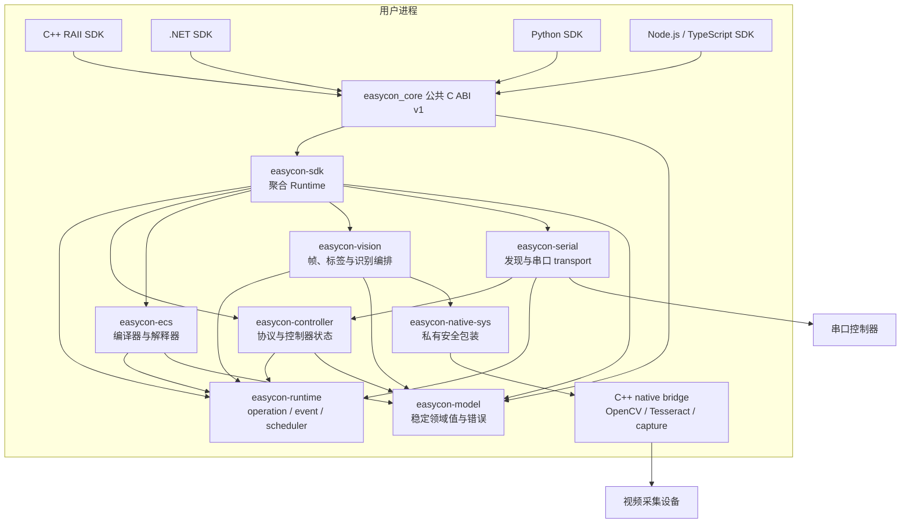
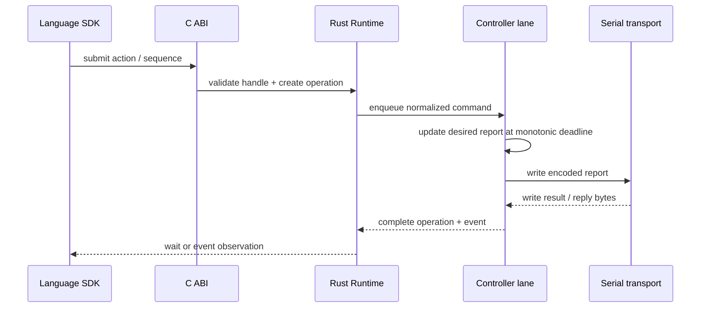
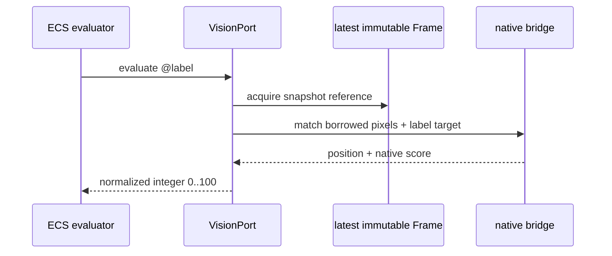

# 架构总览与模块依赖

## 1. 架构目标

**[已决定]** EasyCon SDK v1 是用户进程内加载的共享核心，不要求启动额外进程，也不定义网络协议。四种语言只做类型、异步和生命周期适配，Controller、Automation、Vision 的行为由同一 Rust 实现决定。

设计必须同时满足：

1. 一份业务状态机和调度实现，四语言不分叉。
2. C ABI 可长期兼容，不泄漏 Rust、C++、OpenCV 或 Tesseract 类型。
3. 原生阻塞、异常和资源全部被隔离在明确边界内。
4. Runtime 可以多实例；除只读版本信息外没有进程全局业务状态。
5. 用户可显式等待、取消和关闭；析构只作为最后兜底。
6. v1 范围严格受 [源码能力映射](source-capability-map.md) 约束。

## 2. 运行时组件

箭头只表示编译期依赖。Automation 调用 Controller/Vision 时使用 `easycon-ecs` 定义的内部 port trait，由 `easycon-sdk` 聚合层实现，因此 `easycon-ecs` 不依赖具体设备或 OpenCV。

## 3. Rust crate 边界

### `easycon-model`

- 领域枚举和值对象：按钮、HAT、摇杆坐标、矩形、像素格式、资源 ID、operation ID。
- 稳定错误 domain/code、诊断码和事件内部模型。
- 不含线程、I/O、C ABI 布局和第三方原生类型。
- 是所有 Rust crate 的叶子依赖。

### `easycon-runtime`

- Runtime 根取消令牌、任务监管器、operation registry、事件总线、单调时钟和 deadline。
- 通用的有界队列、资源登记、Runtime-owned supervised spawn/join、关闭协调与 panic 转换。
- 提供可替换 `Clock`、executor/transport fake 接口，支持确定性测试。
- 不知道按钮、ECS 语法、OpenCV 或具体串口协议。

### `easycon-controller`

- Switch report、7 位报文编码、命令/响应协议和握手。
- Controller 状态机、desired-state、单写者命令 lane、动作序列调度、控制权 lease 和 Amiibo 分包。
- 定义 `ControllerTransport` trait；不直接依赖操作系统串口包。
- 任何报告状态只能在 controller lane 中修改。

### `easycon-serial`

- Windows 串口发现和 `ControllerTransport` 的系统实现。
- 打开/关闭端口、可取消读写、热拔出错误归一化。
- 不解释 Switch report，不拥有 Controller 状态机。
- 后续平台实现放在同 crate 的 target-specific module，不改变上层契约。

### `easycon-ecs`

- UTF-8 source bundle、lexer、parser、binder、lowerer、不可变 Program 和 evaluator。
- 诊断包含稳定 code、severity、文件、UTF-8 byte span、1-based 行列。
- 定义 `ControllerPort`、`VisionPort`、`OutputPort`，不依赖其具体实现。
- 运行使用显式 seed 和单调时钟；不读取进程当前目录、环境变量或 UI 配置。
- v1 不暴露任意调用方函数回调。

### `easycon-native-sys`

- 私有 C 风格桥接声明与最小 unsafe 区域。
- 把 native status/error/handle 包装成 Rust RAII 类型；所有 public Rust 方法均为安全接口。
- 只表达图像、OCR、模板、颜色和 capture 的低级操作，不表达 SDK Runtime。
- 该 crate 和内部头文件都不安装到最终 SDK。

### `easycon-vision`

- capture session、最新帧槽、不可变 Frame/Image、`.IL` parser、label registry。
- 模板/OCR/颜色 operation 的输入校验、ROI、并发限制、分数归一化和结果模型。
- 调用 `easycon-native-sys`，但不暴露其 handle。
- OCR engine cache/pool 的策略归 Rust 所有，单个 engine 的构造和调用由桥接执行。

### `easycon-sdk`

- 唯一聚合根：创建 Runtime，连接 Controller、Vision 和 ECS ports。
- 执行“同一 Runtime 最多一个 Automation run”“Automation 独占 Controller 写 lease”等跨域规则。
- 负责资源树、关闭顺序、统一事件和版本/build metadata。
- 不包含语言绑定或 C 布局。

### `easycon-capi`

- 构建 `cdylib`，导出 `easycon_v1_*` 符号。
- 只做参数验证、句柄解析、结构体版本处理、错误/operation/event 适配和 panic guard。
- 不写业务分支，不直接调用 native bridge。
- 也是唯一 public native binary 的链接根。

## 4. C++ native bridge

**[已决定]** C++ bridge 是 `easycon_core.dll` 的私有链接组成部分，不单独发布公共 SDK，也不拥有第二套业务 API。

允许职责：

- 枚举和打开视频采集设备。
- 读取 frame，查询实际宽高、FPS、backend 和像素格式。
- 图像解码/编码、颜色空间转换、ROI 和模板匹配。
- Tesseract engine 创建、OCR 和释放。
- Rust 标准库或成熟 crate 无法可靠承担、且经过 ADR 认可的窄系统调用。

禁止职责：

- Runtime、Controller、Automation 或 Vision 公共状态机。
- operation、事件队列、重试、调度、超时策略或控制器 lease。
- ECS parser/evaluator、`.IL` 业务格式和分数策略。
- 调用任何语言运行时或反向调用用户代码。
- 启动不受 Rust task supervisor 管理的长期线程。

内部桥接函数必须是 C-compatible、`noexcept`，捕获所有 C++ 异常并返回 native status + owned error。OpenCV/Tesseract 对象只能通过私有不透明 handle 存活；Rust RAII wrapper 是其唯一上层 owner。

### 平台 adapter 分层

**[已决定]** Vision 的 Rust 状态机和 native common 算法平台中立。native source 分为 `common`、
`platform/windows`、`platform/linux` 和 fail-closed `platform/macos`：

- `common` 拥有 fixed-width private C 数据模型、exception/ownership、codec/template/OCR/color、预验证 File glue；
- Windows adapter 独占 COM、DirectShow、Media Foundation、HRESULT/HANDLE 与对应系统库；
- Linux adapter 只建立 V4L2 admission 边界，未经过真实设备矩阵前不声明 discovery/profile/FPS；
- macOS 只形成 Apple Silicon arm64 experimental unavailable adapter，不实现或伪造 AVFoundation。

新增平台不得修改 Frame/Image/Label、Capture 五态、operation、latest slot、pool、cancel/deadline 或
interrupt/handoff/join/handle-release 语义。完整约束见
[Phase 3 跨平台边界设计](../development/phase3-cross-platform-design.md)。

## 5. 公共 C ABI 与语言层

公共 native 层只安装：

- `easycon_core.dll`：Rust `easycon-capi` + 静态链接的 Rust crates 和私有 C++ bridge。
- `easycon_core.lib`：仅 C/C++ 链接需要的 import library。
- `include/easycon/easycon.h`：实现阶段生成并冻结的 C ABI 头。
- `easycon-native.json`：版本、ABI、build ID、target 和依赖哈希清单。

四种绑定的依赖方式：

| SDK | 底层方式 | 不允许 |
| --- | --- | --- |
| C++ | header/source RAII wrapper 链接 import library | 引用私有 bridge 头或 Rust 符号 |
| .NET | `LibraryImport`/PInvoke + `SafeHandle` | C++/CLI、复制 ECS 或 Controller 逻辑 |
| Python | `ctypes` 生成层 + Python 包装 | 导入 Rust 扩展绕过 C ABI |
| Node.js | 稳定 Node-API addon 调用 C ABI | 浏览器 fallback、直接链接 Rust crate |

完整接口形态见 [语言绑定](language-bindings.md)，ABI 规则见 [C ABI v1](c-abi-v1.md)。

## 6. 数据流

### Controller 命令

### Automation 读取图像标签

同一次标签求值只使用一个 frame；frame 在 native 调用结束前保持有效。采集线程可同时发布下一帧，不会修改已有 frame。

## 7. 依赖方向与禁止依赖

以下规则由 workspace lint、Cargo feature 审计和 include/import 检查强制执行：

1. `easycon-model` 不依赖任何其他 workspace crate。
2. `easycon-runtime` 不依赖 Controller、ECS、Vision、serial 或 native。
3. `easycon-ecs` 不依赖 Controller/Vision concrete crate，只依赖 port trait。
4. `easycon-controller` 不依赖 serial 的系统实现。
5. 只有 `easycon-vision` 可以依赖 `easycon-native-sys`；只有 `easycon-native-sys` 可以 include 私有 bridge header。
6. 只有 `easycon-capi` 可以导出 public native 符号；其他 crate 默认隐藏符号。
7. 各语言绑定只能依赖 public C ABI 和各自语言的包装代码。
8. 原生核心不依赖 .NET、CPython、Node、GUI 框架、网络服务或应用配置目录。
9. `EasyCon/` 不得出现在 Cargo/CMake/MSBuild/package manifest、CI checkout、submodule 或下载脚本中。
10. 官方包不得各自编译不同 feature 组合的核心；同一版本、target 的 build ID 必须一致。

## 8. 架构不变量

- 每个可变硬件资源只有一个写入 lane。
- 每个异步调用都有 operation ID、终态和可追踪 error/event。
- wait timeout 不等于 operation deadline，也不隐式取消 operation。
- 任何 cancel/close 完成之前，资源相关任务已经退出或被父 Runtime 继续监管。
- 长期 task 只能由 Runtime 受控创建并持有 `JoinHandle`；调用方不能手工登记或绑定 task owner。
- 只有显式 Runtime close 承诺 cleanup、join、registry 收敛和最终事件；Drop 只拒绝 admission 并请求取消。
- Runtime 关闭失败是保存的 `CloseFailed` outcome，不借用 `Closing` 或跨 API panic 表示。
- Operation terminal transaction 在封闭 child admission 后才 cleanup/commit，并无条件通知 waiter。
- Automation 终态在 Controller 中立化和 lease 释放之后才可观察。
- C++ exception、Rust panic 和语言 exception 都不能跨越各自二进制边界。
- 事件是观测面，不是驱动状态正确性的唯一通道；即使消费者丢事件，也能查询最终状态。
- 资源和 operation 的内部 ID 在一个 Runtime 内唯一且不复用。

## 9. 推导与待确认

**[推导]** Windows Tier 1 并不允许在 Rust 核心中散布 Win32 类型。串口与采集都是 trait/bridge 实现，
因此 Linux x64 candidate 和 macOS arm64 experimental source 增加的是叶子 adapter，不是新的核心。

**[推导]** 只发布一个公共 native binary，能消除 Rust/C++ 双 ABI、跨 CRT 释放和四语言装载不同核心的风险。

**[待确认]** O-01 至 O-04 的硬件与模型数据会调整能力表、默认参数和测试阈值，但不得改变上述 crate、依赖或所有权边界。登记见 [文档索引](../README.md#待确认登记)。
