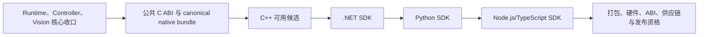

# 目标仓库结构与实施路线

本章落实 [ADR-0023](../decisions/0023-v1-host-language-sdk-roadmap-and-ecs-deferral.md) 的 v1 路线。v1 的产品主线只有
Runtime、Controller、Vision、公共 C ABI、四语言 SDK 和发布资格；目录会随阶段创建，不要求当前工作树预先具备全部交付物。

## 1. 目标结构

```text
easycon sdk/
├── Cargo.toml
├── rust-toolchain.toml
├── CMakeLists.txt
├── CMakePresets.json
├── LICENSE
├── README.md
├── docs/
│   ├── README.md
│   ├── architecture/
│   └── decisions/
├── spec/
│   ├── abi/
│   ├── behavior/
│   ├── conformance/
│   ├── fixtures/{controller,ecs,vision}/
│   └── schemas/
├── crates/
│   ├── easycon-model/
│   ├── easycon-runtime/
│   ├── easycon-controller/
│   ├── easycon-serial/
│   ├── easycon-ecs/          # dormant workspace maintenance，非 v1 产品路径
│   ├── easycon-native-sys/
│   ├── easycon-vision/
│   ├── easycon-sdk/
│   └── easycon-capi/
├── native/
│   └── bridge/
├── include/easycon/          # 生成的 public C header 输出
├── bindings/{cpp,dotnet,python,node}/
├── tests/{support,integration,abi,conformance,fault,packaging,hardware}/
├── packaging/{cmake,nuget,pypi,npm}/
├── tools/{xtask,abi-gen,conformance-runner,license}/
├── ci/
└── artifacts/                # ignored
```

`EasyCon/` 保持根级 ignored 的只读参考源码，不进入 workspace、build graph、CI、package 或 target tree。

## 2. 所有权与边界

| 区域 | v1 角色 | 约束 |
| --- | --- | --- |
| `docs/`、`spec/behavior`、ADR | 产品与架构合同 | 行为变化先更新规范；路线以 ADR-0023 为准 |
| `crates/easycon-model,runtime,sdk,capi` | Runtime/聚合/ABI 核心 | 不引入 ECS port 或语言特有逻辑 |
| `crates/easycon-controller,serial` | Controller | 单写者 lane、ActionSequence、协议与硬件边界 |
| `crates/easycon-vision,native/bridge,native-sys` | Vision/native | C++ 不上移业务状态 |
| `bindings/<language>` 与 packaging | 各语言 SDK | 只消费已冻结 ABI 与 canonical native bundle |
| `crates/easycon-ecs` 与 ECS spec/fixture/conformance/validator/guards | dormant workspace maintenance | 保留现有健康门禁；不进入 v1 ABI、绑定、硬件、soak 或发布验收 |

历史 ADR-0017、ADR-0019 和 ADR-0021 继续保存未来 ECS 合同；本章不把它们作为 v1 的实施前置。ADR-0018 和 ADR-0020
中的通用 Runtime/Controller correctness 仍可用于第一阶段，但其 ECS 专属命名和 DAG 不定义本章的进度。

## 3. 四个产品阶段

### Runtime、Controller、Vision 核心收口

交付：

- Runtime 的 operation、事件、取消、deadline、资源监管和确定性 close；
- Controller 的发现、连接、单写者 lane、Amiibo、lease、中立化和 `ActionSequence`；
- Vision 的 capture、Frame/Image/Label、模板、OCR、颜色与私有 native bridge；
- 虚拟时钟、fake transport、synthetic native backend 与针对成功、失败、取消、超时和 close 的确定性测试。

退出门槛：核心行为、所有权与关闭顺序由实现测试覆盖；ActionSequence 的精确时间线经过核心校验；Controller 与 Vision
不依赖语言 binding 才能运行。软件收口不把真实设备资格、四语言 package 或正式 ABI 冻结提前声明为完成。

当前状态：此阶段正在进行。Runtime 的通用修复候选仍须独立固定 SHA 审查；Controller settlement 尚未完成；Vision 已有源码候选，
但 capture hardware 仍未验证。

### 公共 C ABI 与 canonical native bundle

交付：

- `easycon-sdk` 聚合 Runtime、Controller、Vision，`easycon-capi` 作为唯一 public native 链接根；
- 机器可读 ABI manifest、生成 C header、symbol allowlist、C/C++ smoke 与 layout golden；
- 一份带 build metadata 的 canonical native bundle，供全部语言 SDK 消费。

退出门槛：ABI 的 ownership、错误、operation、事件、Controller 与 Vision 形态已冻结；同一 bundle 通过 ABI 与 native
smoke。C ABI 不包含 Program、compile/run、Automation handles/errors/events 或 ECS diagnostics/source limits。

### 各语言 SDK

交付顺序固定为 C++、.NET、Python、Node.js/TypeScript。C++ 先形成可用候选，随后语言按同一 ABI/native bundle 完成惯用
ownership、异步、错误和 package 适配。

每种语言的任务树相同：

```text
language-sdk
├── generated low-level declarations
├── native loader and handle ownership
├── error and immutable value mapping
├── operation, cancellation and event adapter
├── Controller direct calls and ActionSequence
├── Vision capture, Frame/Image/Label calls
├── lifecycle and disposal tests
├── package assembly from canonical bundle
└── clean-environment install smoke
```

退出门槛：每种 SDK 只适配 public C ABI，且与 canonical bundle 的 build ID 匹配。C++ 候选只证明该语言的阶段性可用性；
四语言共同验收和 GA 仍属于第四阶段。

### 打包、真实硬件、ABI、供应链与发布资格

交付：

- CMake ZIP、NuGet、wheel 与 npm/platform packages；
- 真正的 Controller/capture 支持矩阵、时序、拔插、资源关闭和长稳证据；
- ABI 兼容矩阵、SBOM、license/notices、source archive、checksum 与签名；
- clean VM 安装与四语言 release candidate 验收。

退出门槛：四语言共享同一 release train、同一 canonical bundle；真实硬件、ABI、供应链和 soak 都有可审计证据；
O-01 至 O-04 与 OCR 发行输入在各自门槛关闭。ECS maintenance 检查仍必须作为仓库健康门禁通过；其结果不替代、也不扩展
这些 v1 product/release evidence。

## 4. 产品依赖



Controller、Vision 和 Runtime 可在第一阶段的既有依赖边界内并行收口。后续语言顺序是实施优先级，不允许任何语言绕过
canonical bundle 或在本地复制核心业务逻辑。

## 5. 核心完成门槛

只有以下条件全部满足，才能开始 ABI 冻结和 canonical bundle 候选：

1. Runtime、Controller、Vision 的状态机、错误和关闭顺序由实现测试覆盖。
2. fake serial/native 能运行共同场景，不需要物理硬件或 `EasyCon/`。
3. Controller report、`ActionSequence` 和 Vision fixture 具有明确的 exact/corrected 分类。
4. Controller lease、取消、中立化、stream settlement 与精确时序的成功/失败边界已覆盖。
5. Capture read 可中断，Runtime close 后没有活动 task、resource 或 native handle。
6. C++ exception 与 Rust panic 隔离通过，无跨 ABI unwind。
7. ABI manifest 能生成 C header、声明和 symbol allowlist，并有 C/C++ smoke。
8. status/error/event/struct/ownership/blocking 文档不依赖 binding 猜测，也不凭空承诺公共 `wait()` API。
9. canonical native bundle 含 ABI/build metadata，binding 可在 fake 模式运行。
10. GPL 来源、版权和 dependency license 初审完成。

## 6. 阶段性禁止项

- 在 ABI 阶段前承诺正式 C header 或稳定 symbol。
- 在 canonical bundle 前让语言 package 分别自编 native core。
- 在语言层实现 Controller、ActionSequence、Vision score、资源关闭或错误语义。
- 把 `.ecs`、Program、Automation、Python/Lua runner、字节码、固件、UI、远程服务或自定义回调纳入 v1。
- 为了 demo 放宽 Controller 单写者、ActionSequence 的核心时间线或 Runtime close 规则。
- 把 `EasyCon/` 变成 workspace member、submodule、下载源或 CI requirement。

## 7. ECS 重新打开条件

未来若恢复 ECS，必须另建 ADR，重新决定产品范围、公共 API/ABI、兼容性、资源与安全边界、fixture/conformance、硬件影响和
测试成本。ADR-0017、ADR-0019、ADR-0021 或 dormant maintenance 资产都不构成自动恢复授权。

## 8. 关联

- [ADR-0023：v1 宿主语言 SDK 路线与 ECS 延后](../decisions/0023-v1-host-language-sdk-roadmap-and-ecs-deferral.md)
- [架构总览](architecture-overview.md)
- [C ABI v1](c-abi-v1.md)
- [语言绑定](language-bindings.md)
- [测试策略](testing-strategy.md)
- [构建、发布与合规](build-release.md)
