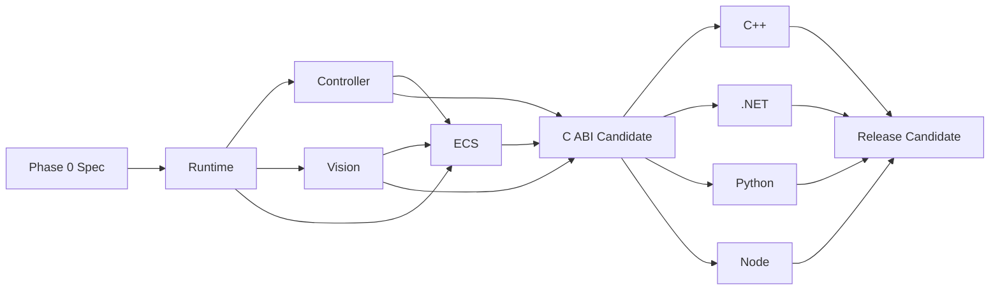

# 目标仓库结构与实施路线

## 1. 固定目标结构

本章固定 v1 的目标结构与阶段门槛；目录会随对应阶段逐步创建，不要求当前工作树一次具备全部项目。
仓库当前已经按 [ADR-0007](../decisions/0007-phase-1-freeze.md) 冻结 Phase 1 Runtime，并完成一段无硬件
Controller fake vertical slice，详见 [实现说明](../development/runtime-controller-vertical-slice.md)。该
Controller slice 不表示 Phase 2 所要求的 Windows serial、Amiibo、硬件 characterization 或 O-01/O-02
数据已经完成。

```text
easycon sdk/
├── Cargo.toml
├── rust-toolchain.toml
├── CMakeLists.txt
├── CMakePresets.json
├── LICENSE
├── README.md
├── docs/
│   ├── README.md
│   ├── architecture/
│   └── decisions/
├── spec/
│   ├── abi/
│   ├── behavior/
│   ├── conformance/
│   ├── fixtures/{controller,ecs,vision}/
│   └── schemas/
├── crates/
│   ├── easycon-model/
│   ├── easycon-runtime/
│   ├── easycon-controller/
│   ├── easycon-serial/
│   ├── easycon-ecs/
│   ├── easycon-native-sys/
│   ├── easycon-vision/
│   ├── easycon-sdk/
│   └── easycon-capi/
├── native/
│   └── bridge/
│       ├── include/internal/
│       ├── src/
│       └── tests/
├── include/easycon/                 # 生成的 public C header 输出
├── bindings/
│   ├── cpp/
│   ├── dotnet/
│   ├── python/
│   └── node/
├── tests/
│   ├── support/
│   ├── integration/
│   ├── abi/
│   ├── conformance/
│   ├── fault/
│   ├── packaging/
│   └── hardware/
├── packaging/
│   ├── cmake/
│   ├── nuget/
│   ├── pypi/
│   └── npm/
├── tools/
│   ├── xtask/
│   ├── abi-gen/
│   ├── conformance-runner/
│   └── license/
├── ci/
└── artifacts/                       # ignored
```

`EasyCon/` 保持根级 ignored sibling，不出现在 workspace、build graph 或 target tree 中。`.tools/` 继续用于本地临时工具并忽略；可发布的工具进入 tracked `tools/`。

## 2. 文件所有权

| 区域 | 主要 owner | 变更约束 |
| --- | --- | --- |
| `docs/`, `spec/behavior`, ADR | architecture/core maintainer | 行为变化先改规范 |
| `spec/abi`, `include/`, `tools/abi-gen` | C ABI owner | binding 分支不得直接改生成输出 |
| `crates/easycon-model,runtime,sdk,capi` | core/runtime team | 跨域状态和关闭顺序集中审查 |
| `crates/easycon-controller,serial` | Controller team | 不引入 native vision/语言依赖 |
| `crates/easycon-ecs` | Automation team | 只通过 ports 接其他域 |
| `crates/easycon-vision,native/bridge,native-sys` | Vision/native team | C++ 不上移业务状态 |
| `bindings/<language>` + 对应 packaging | 各语言 owner | 只消费已冻结 ABI manifest |
| `spec/conformance`, `tests/conformance` | shared quality owner | 不接受语言私有 expected |

## 3. 实施阶段

### Phase 0：规范与 fixture 基线

交付：

- 把本文档中的 enum、defaults、state、error、event、limit 转成 versioned behavior spec。
- 建立 Controller/ECS/Vision 最小黄金 fixture，标记 exact/corrected/excluded。
- 定义 ABI manifest schema、conformance trace schema 和 build metadata schema。
- 记录 O-01/O-02/O-03/O-04 的负责人和验证设备。

退出门槛：规范 schema 可机器校验；fixture 不读取 `EasyCon/`；所有公开语义有唯一来源。

### Phase 1：model、runtime 与测试骨架（Frozen）

状态：已冻结。可执行实现基线为 `4261925dc4e84b36e8491c0a97c17048d3eacd84`；范围和重新打开规则见
[ADR-0007](../decisions/0007-phase-1-freeze.md)。

交付：

- `easycon-model`、`easycon-runtime`、test support、VirtualClock。
- Operation、取消树、事件 subscription、resource registry、确定性 close。
- panic guard 原型和错误链，不导出正式 C ABI。

退出门槛：runtime 单元/模型测试、Loom 关键模型、fault tests 全过；Runtime close 后活动 task/resource 为零。

### Phase 2：Controller vertical slice

状态：进行中。当前只有无硬件 fake slice，尚未达到本阶段退出门槛。

交付：

- report/protocol、FakeTransport、Windows serial、连接状态机。
- direct actions、precise sequence、Amiibo、lease 和 neutralization。
- fake end-to-end + 首批硬件 characterization。

退出门槛：协议 golden、10,000-step fake、cancel/断线清理和 O-01/O-02 初版能力数据通过；不含固件功能。

### Phase 3：Vision 与私有 bridge

交付：

- C++ capture/image/template/OCR/color 窄桥接。
- Frame/Image/Label、latest slot、`.IL`、native pool 和 synthetic capture。
- native exception isolation 和 sanitizer harness。

退出门槛：Vision fixture、资源计数、可中断 capture close、missing model/invalid image/fault tests 通过；`.ILX` 不进入 API。

### Phase 4：ECS 与跨域 Automation

交付：

- Rust ECS lexer/parser/binder/lowerer/evaluator。
- Controller/Vision/Output ports、Program、Run operation、diagnostics/log/events。
- source bundle/受限目录 loader、deterministic seed/time。

退出门槛：ECS exact/corrected corpus 通过；run success/failure/cancel 均先中立化；无 Python/Lua/字节码。

### Phase 5：C ABI Candidate

交付：

- `easycon-sdk` 聚合与 `easycon-capi` reference implementation。
- ABI manifest generator、candidate header、C/C++ smoke、symbol/layout golden。
- canonical fake-enabled native bundle 和 core conformance runner。

退出门槛见下方“核心完成门槛”。此前 ABI 仍可改，之后只允许兼容新增或经 ADR 重开 major。

### Phase 6：四语言并行绑定

四个 binding 从同一个 `core-v1-api-candidate.1` 基线并行，只改各自 ownership 区和共同测试 runner adapter。发现 ABI 缺口时提交最小 spec/ABI change 到 core 主线，四分支统一 rebase，不在单一语言做旁路。

退出门槛：四种语言共同 trace 零差异、专项 cancel/dispose 通过、package prototype 使用相同 native build ID。

### Phase 7：发布工程与硬件 RC

交付：

- CMake ZIP、NuGet、wheel、npm/platform package。
- SBOM、notices、source archive、签名/checksum。
- clean VM、硬件矩阵、时序、capture、24h soak。

退出门槛：[测试策略的 Release Candidate](testing-strategy.md#release-candidate) 全部通过。

## 4. 核心完成门槛

只有以下条件全部满足，才能把共享核心交给四语言 worktree 并冻结 ABI candidate：

1. Runtime/Controller/Automation/Vision 的状态机和关闭顺序由实现测试覆盖。
2. Fake serial/native 可运行全部共同场景，不需要物理硬件或 `EasyCon/`。
3. Controller report、ECS、`.IL`/Vision fixture 已完成 exact/corrected 分类。
4. 所有 operation 都可 wait/cancel/query；wait timeout、deadline、protocol timeout 已区分。
5. Automation 任一终态之前完成中立化和 lease 释放。
6. Capture read 可中断，Runtime close 后无活动 task/thread/native handle。
7. C++ exception 与 Rust panic 注入通过，无跨 ABI unwind。
8. ABI manifest 能生成 C 头/声明/symbol allowlist，C/C++ smoke 通过。
9. status/error/event/struct/ownership/blocking 文档齐全，不能靠 binding 猜测。
10. canonical native bundle 含 ABI/build metadata；binding 可在 fake 模式运行。
11. GPL 来源、版权、dependency license 初审完成。
12. core API review 明确没有首批排除能力和已清除架构残留。

“能够调用一个函数”或“某语言 demo 可跑”不构成核心完成。

## 5. 四语言 worktree 与任务树

建议在 core candidate tag 后创建四个 sibling worktree：

| worktree | branch | 独占范围 | 主要任务 |
| --- | --- | --- | --- |
| `../easycon-sdk-cpp` | `codex/sdk-cpp-v1` | `bindings/cpp`, `packaging/cmake` | RAII、Operation、stop_token、CMake targets |
| `../easycon-sdk-dotnet` | `codex/sdk-dotnet-v1` | `bindings/dotnet`, `packaging/nuget` | SafeHandle、Task、CancellationToken、NuGet |
| `../easycon-sdk-python` | `codex/sdk-python-v1` | `bindings/python`, `packaging/pypi` | ctypes、context/asyncio、wheel |
| `../easycon-sdk-node` | `codex/sdk-node-v1` | `bindings/node`, `packaging/npm` | Node-API、Promise/AbortSignal、npm |

主 worktree 保留在 core/integration branch，负责 `crates/`、`native/`、`spec/abi`、生成器和 canonical bundle。

任务树对每种语言都相同：

```text
binding-v1
├── generated low-level declarations
├── handle ownership and loader
├── error and value mapping
├── operation + cancellation adapter
├── event subscription adapter
├── Controller API
├── Automation API
├── Vision API
├── common conformance adapter
├── language-specific lifecycle tests
├── package assembly from canonical bundle
└── clean-environment install smoke
```

### 并行约束

- 四分支不编辑 `spec/abi`、public C header 或 core crate；ABI 缺口回主线处理。
- conformance expected 只有主线一份。binding 分支只能实现 adapter，不能改期望来让本语言通过。
- package job 接受 `EASYCON_NATIVE_BUNDLE` 输入和 expected hash，禁止本地重编 native。
- 公共文档表格由主线最终汇总，避免四分支同文件冲突。
- 合并顺序不代表优先级；每个 binding 独立通过后可合并，但 release 必须四个都通过。

## 6. 关键依赖顺序



Controller、Vision、ECS 的内部开发可在 Runtime 基线上并行，但 Automation 集成依赖 Controller/Vision ports，C ABI candidate 依赖三个域都稳定。

## 7. 变更治理

以下变化必须 ADR：

- 引入额外进程、网络控制面或回调式公共 ABI；
- 把业务状态移入 C++ bridge 或任一语言 binding；
- 改变 Runtime/Operation/事件/关闭模型；
- 放宽 Controller 单写者/Automation lease；
- 把 `.ILX`、Python/Lua、固件或 UI 纳入 v1；
- 增加 v1.0 支持平台；
- 破坏 public C ABI 或 GPL 分发政策。

普通 bug fix、兼容尾字段和新增 fixture 不需要 ADR，但必须更新行为规范和共同测试。

## 8. 阶段性禁止项

在对应 Phase 之前不得提前：

- 在 Phase 5 前承诺正式 C header 或稳定 symbol。
- 在 core completion 前为四语言复制临时业务逻辑。
- 在 canonical bundle 前分别打包自编 DLL。
- 在 O-03 核验前从本地快照复制 OCR 模型。
- 为了 demo 引入被排除能力、进程服务或 UI。
- 把 `EasyCon/` 变成 workspace member、submodule、下载源或 CI requirement。
