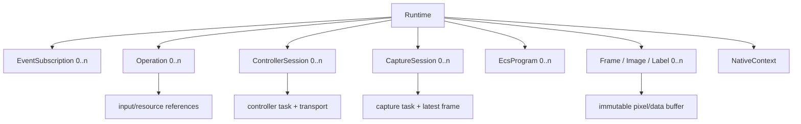
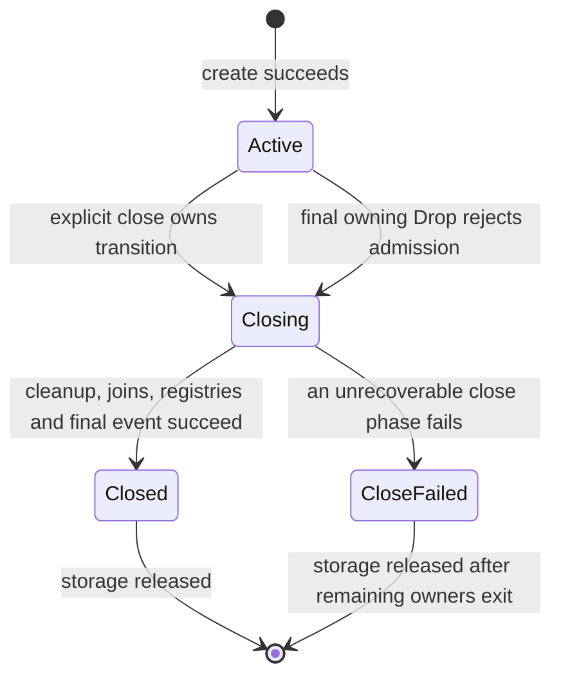
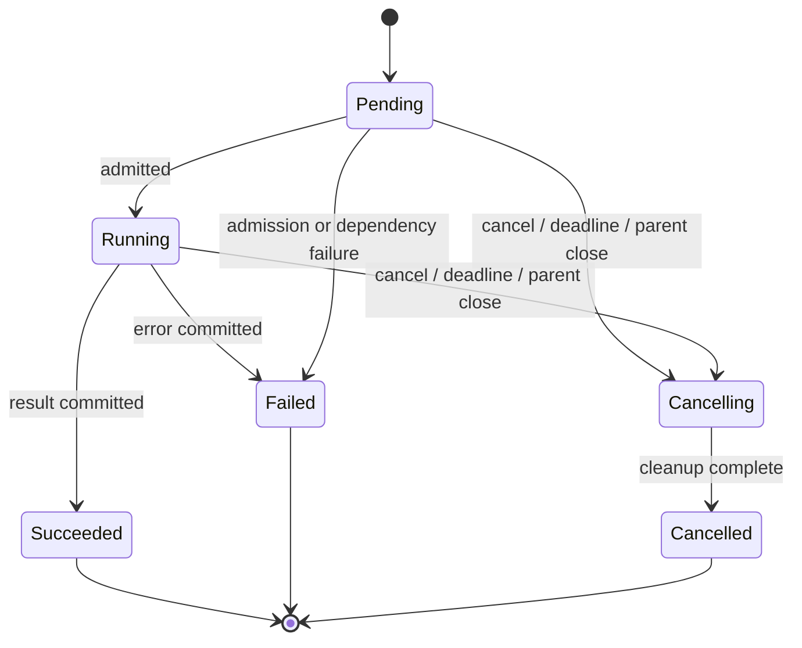
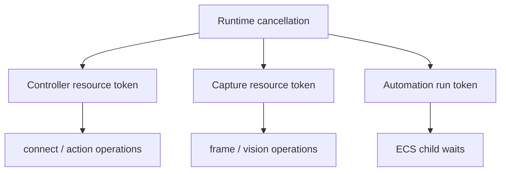
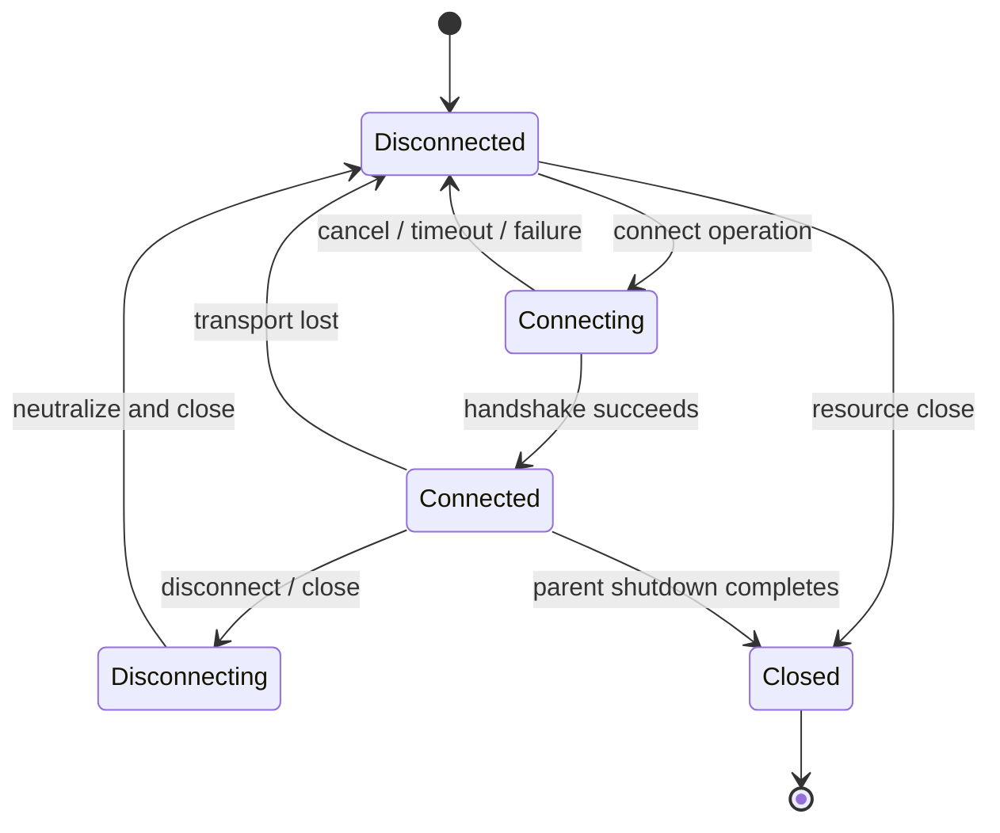
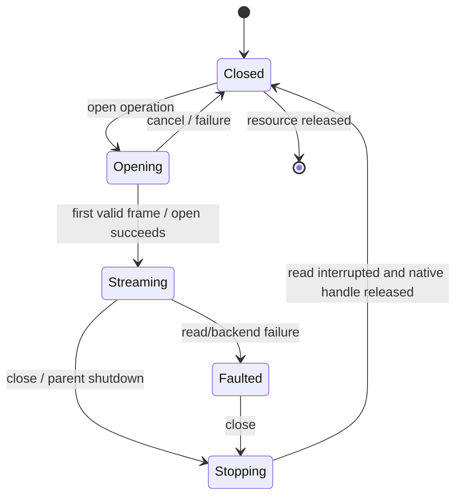
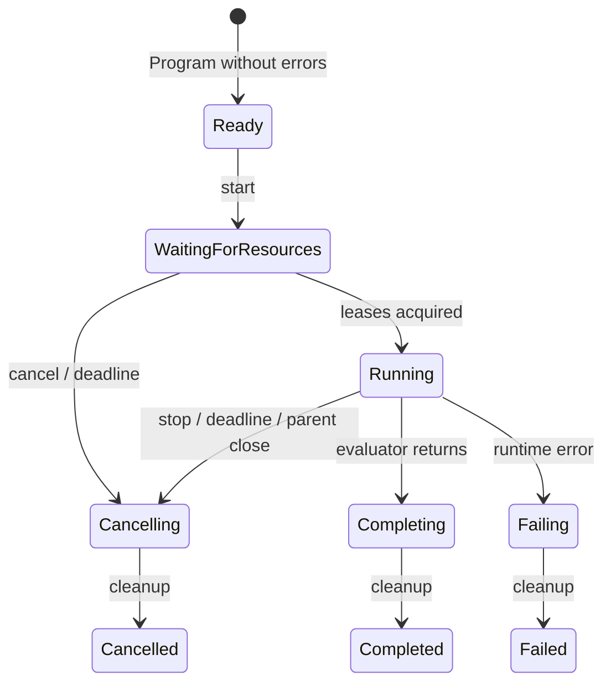

# 生命周期与并发

## 1. 所有权树

**[已决定]** `Runtime` 是所有资源的根 owner。调用方持有的每个 C ABI handle 是对内部对象的强引用和访问凭证；Runtime 同时在 registry 中监管仍处于活动状态的资源。

所有资源记录不可变 `runtime_id`。跨 Runtime 混用 handle 返回 `WRONG_RUNTIME`，不能静默复制或采用调用方对象。

### 句柄释放与资源关闭

- `release(handle)` 释放调用方引用，不等同于取消仍在运行的 operation。
- Controller、Capture 和 Runtime 是主动资源，先显式 `close` 并检查结果，再 `release`。binding
  finalizer/析构只能非阻塞 release 已关闭对象或报告遗漏，不得替代 close。
- Program、Frame、Image、Label、Event 和已终态 Operation 是被动资源，最后引用释放即销毁。
- 若调用方提前释放活动 Operation，Runtime 继续监管到终态并发出事件；不会产生脱管任务。
- 同一个 raw handle 与其 `release` 并发是调用方数据竞争；其他已声明线程安全的调用可并发。

## 2. Runtime 状态机

| 状态 | 接受新资源 | 接受查询 | 事件 |
| --- | --- | --- | --- |
| Active | 是 | 是 | 正常发布 |
| Closing | 否，返回 `RUNTIME_CLOSING` | 只允许状态、wait、error 和 drain | 发布关闭进度及资源终态 |
| Closed | 否 | 只允许版本化 handle 销毁 | subscription 收到 closed 后结束 |
| CloseFailed | 否，永久拒绝 | 允许状态、保存的 close report、operation wait/query 和 drain | subscription 收到 close_failed 后结束 |

`Closing` 只表示关闭事务正在执行或最后 owning handle 已请求非确定性取消，不能同时表示已经失败。
显式 close 保存唯一 `CloseOutcome::Closed` 或 `CloseOutcome::Failed(CloseReport)`；并发和后续 close
caller 返回同一保存结果，不重复执行副作用。最后 owning handle 的 `Drop` 没有 close outcome。

Runtime 创建是同步的，只完成内存、executor、native context 和队列初始化，不扫描/打开硬件。任何初始化失败都不会返回半有效 Runtime。

## 3. 并发拓扑

每个 Runtime 拥有：

1. 一个通用异步 executor，负责 operation 协调、deadline、状态转换和非阻塞工作。
2. 每个已连接 Controller 一个专用 command/scheduler 线程，保证报告的单写者和时间顺序。
3. 每个已打开 Capture 一个专用读线程；只有该线程调用 capture read。
4. 一个有界 native compute pool，执行模板匹配、编码和 OCR；线程数由 Runtime options 限制。
5. 一个事件分发器，把不可变事件复制到各 subscription 的有界队列。

语言线程永远不会被用作核心 executor。除明确命名为 `wait`、`read`、`close` 的函数外，C ABI 调用只做有限验证和入队，不执行硬件 I/O 或长时间 native 计算。

## 4. Operation 模型

### Operation 不变量

- `Succeeded`、`Failed`、`Cancelled` 是唯一终态，且只写一次。
- `Cancelling` 表示已经请求取消但清理尚未结束；语言层不得提前把 Task/Promise 标成 canceled。
- result/error 在终态提交前构造完成，提交后不可变。
- terminal event 与终态提交在同一有序临界区完成；查询一定能看到不早于事件的状态。
- `cancel` 幂等。对终态 operation 调用 cancel 返回成功但不改变结果。
- 释放 observation handle 不取消 operation。
- parent 开始终态事务时先封闭 cancellation node；在此之后 child admission 必须失败。已经在线性化点前
  admission 的 child 会被取消并继续由自己的 owner 清理。
- 终态事务依次封闭 child admission、取消 subtree、执行 owner cleanup、提交 immutable 终态和 terminal
  event、注销 registry，最后无条件通知全部 waiter。event、registry 或 poisoned lock 故障不得跳过
  注销和通知。
- owner cleanup panic 转成可诊断 internal failure，不得留下不可观察的半终态；terminal event 仍不是
  waiter 正确性的唯一通道。

### wait、deadline 与 timeout

三个概念严格分开：

- **wait timeout**：调用方愿意阻塞多久。超时只返回 `WAIT_TIMEOUT`，operation 继续。
- **operation deadline**：请求 options 中的执行期限。到期后核心请求取消，最终通常为 `Cancelled`，error reason 为 deadline。
- **协议 timeout**：握手、ACK、读帧等一次 I/O 的内部期限。耗尽重试后 operation 为 `Failed`，error domain 为 device/I/O。

所有期限都从单调时钟计算。`0` 表示轮询，`UINT64_MAX` 表示无限等待；公共 API 不使用负数或壁钟时间。

## 5. 取消树

父 token 取消必然传播到子 token；子 operation 取消不影响同级资源。Automation run 还持有 Controller lease，取消时按以下顺序执行：

取消传播逐个隔离 hook panic。一个 hook 失败不能阻止同一 token 的其余 hook 或任一 live child 被取消；
取消树和 Runtime registry 使用 poisoned-lock recovery 或不传播 poison 的同步原语。

1. 停止解释器取得新语句。
2. 取消当前 WAIT、Vision 调用和未提交 Controller step。
3. 在 controller lane 中撤销该 run 的剩余序列。
4. 发送中立报告：所有按钮释放、HAT 居中、双摇杆回中。
5. 等待中立报告进入 transport；若设备已断开，记录 cleanup warning。
6. 释放 Controller lease 和 frame/label 引用。
7. 发出 run terminal event，然后提交 Operation 终态。

这修复了源码中取消可能跳过 `Up` 的问题。`Cancelled` 只描述核心逻辑已经清理；设备物理断开时不能伪称硬件已接收中立报告，warning 必须可观察。

## 6. Controller 状态与调度

### 连接状态机

- 同一 Controller 在 `Connecting`、`Disconnecting` 时拒绝另一连接状态变更 operation。
- v1 不自动重连。transport lost 后发出原因事件，调用方可显式再次 connect。
- connect 的 `Auto` baud 策略按 115200、9600 顺序尝试；每次尝试独立受 deadline 限制。
- 断开先取消动作，再尝试中立报告，最后关闭串口以唤醒阻塞读。

### 单写者 command lane

所有下列动作进入同一 FIFO lane：

- button/HAT/stick state mutation；
- reset；
- precise sequence；
- request/response 命令，如 Amiibo；
- disconnect neutralization。

lane 保存一份 desired report。普通 `down/up/set` 在被 lane 接纳后修改状态，并在不早于上次发送时间 + 30 ms 的目标点发送。不会因多个 API 线程并发而直接竞争 report。

### 精确动作序列

动作序列由 `offset_ns + action` 构成：

1. 提交前完整验证 offset 单调不减、坐标/枚举合法、总时长和 step 数不超限。
2. 起点是在 lane 中获得执行权的单调时刻，而不是调用 API 的壁钟时刻。
3. 相同 offset 的动作先按输入顺序应用，再生成一个合并 report。
4. 不允许早于目标时间发送；后续目标基于原始起点，不累积上一 step 的误差。
5. 两个 report 若小于设备最小间隔，后者延后并记录 timing deviation event，不能丢弃语义转换。
6. 序列默认独占 Controller 写 lease；其他直接写入返回 `RESOURCE_BUSY`，查询不受影响。
7. cancel/失败执行中立化。成功后的最终状态由序列的显式动作决定；便捷 `press` step 会自动包含 release。

普通 report 写入没有源码可证明的设备执行 ACK。direct action operation 在对应 report 字节被 transport 接受后成功；sequence 在最后一个 report 被 transport 接受且内部 cleanup 完成后成功。该成功不虚构 Switch 已物理执行，端到端时序由硬件测试和可观测 dispatch timestamp 衡量。Amiibo 等明确有 ACK 的命令仍以协议回复为成功条件。

Automation run 获取同一 lease，所以脚本动作不会与调用方直接动作交错。以后若需要合流策略，必须新增显式 API 和 ADR，不能改变 v1 默认。

### ACK lane

连接只有一个 request/response matcher。需要 ACK 的命令在报告写入之间串行执行，matcher 由 `(command kind, expected predicate, generation)` 标识。迟到回复不能完成下一请求；断线会失败所有等待请求。

## 7. Capture 与 Frame 生命周期

- 一个 Capture 只有一个读线程和一个 native capture handle。
- 读线程发布不可变 Frame 到 latest slot；替换 slot 只减少旧 Frame 的引用，不修改像素。
- `snapshot` 获取当前 latest Frame 的强引用。没有首帧时可等待 operation deadline 或返回 `NO_FRAME`。
- Frame 持有像素 buffer、width、height、stride、format、sequence 和单调 capture timestamp。
- native vision operation 借用 Frame buffer；operation 完成前持有 Frame 强引用。
- 编码结果是独立 Buffer；调用方拿到的字节不引用 capture 或 native `Mat`。
- Capture close 先取消读，再调用可中断的 native close，join 读线程，最后释放 latest slot 和 native handle。

若底层 backend 不能在配置的关闭期限内中断 read，该 backend 不得进入支持矩阵；不能靠 detach 线程掩盖问题。

## 8. Automation 状态与资源仲裁

Program 是编译产生的不可变资源，可被多个 run 顺序复用。v1 每个 Runtime 同时最多一个 Automation run。

- Program 记录 `requires_controller` 和所需 label names。
- start 在运行前原子检查 Controller 已连接、Capture/labels 可用并获取 lease；失败不执行任何语句。
- Vision 读取与其他 Vision operation 可以并发，但受 native pool 限制；每次 `@label` 使用一个快照。
- PRINT、ALERT、BEEP 按 evaluator 顺序发布 typed automation event。ALERT 不触发网络，BEEP 不调用 UI。
- run start event 包含 seed、program hash 和依赖 resource IDs；相同输入/seed/fake clock 可重放。
- Completed/Failed/Cancelled 都经过同一 cleanup guard。

## 9. 事件队列

### Subscription

每次 subscribe 创建独立、有界、拉取式队列。订阅 options 包含 capacity、severity/domain filter 和是否包含 log。核心不调用用户 callback。

事件公共字段：

- 全 Runtime 单调递增 `sequence`；
- `timestamp_ns`，相对 Runtime 单调 epoch；
- kind、severity、resource ID、operation ID；
- stable code 和 kind-specific typed payload。

### 背压与溢出

- 核心任务永不等待慢消费者。
- 队列为 terminal/error/state 事件保留容量；这些事件可驱逐普通 debug/log 事件。
- 普通日志满时按 oldest-first 丢弃，并合并为一个 `EVENT_GAP`，携带首末 sequence 和 dropped count。
- 若保留区也无法写入，subscription 被标记 overflowed；下一次 read 先返回 gap，状态仍可通过资源/operation query 恢复。
- 关闭时先写入 `RUNTIME_CLOSED`，再把 subscription 置 closed；消费者可 drain 已排队事件。

事件不是业务确认机制。比如 operation 即使 terminal event 被丢，`operation_status/result/error` 仍是权威来源。

## 10. 错误传播

错误在内部是不可变链：

- stable top-level code；
- domain（ABI/runtime/controller/automation/vision/I/O/native）；
- UTF-8 message；
- optional platform/native code；
- optional source diagnostic 或 cause；
- resource/operation IDs。

同步参数错误由 C ABI 的 `out_error` 返回；异步错误存入 Operation 并发 terminal event。Rust panic 映射为 `PANIC`，C++ exception 映射为 `NATIVE_EXCEPTION`；任何异常都不能穿过 ABI。详细规则见 [C ABI v1](c-abi-v1.md)。

## 11. Runtime 确定性关闭顺序

`Runtime.close` 是唯一确定性关闭路径。第一个外部 caller 取得 close ownership 后严格执行：

1. 原子进入 Closing，永久拒绝新 resource、operation、subscription 和 task admission。
2. 发布 closing 进度并请求根 cancellation tree 取消。
3. 按 Runtime ID 顺序关闭 Controller/Capture 等 resource；每个 callback panic 单独捕获，健康资源继续。
4. 等待 resource owner cleanup 完成，并等待、join 全部普通受监管 task。
5. 只有对应 owner task 已退出后，才以 internal cancellation 兜底完成仍未终态的 operation。
6. 停止并 join deadline/executor/scheduler 等 Runtime 内部 task，回收全部 Runtime-owned `JoinHandle`。
7. 验证 operation、resource、active task 和待 join task registry 全部为空。
8. 发布唯一 `RuntimeClosed`，关闭事件生产端并允许 subscription drain。
9. 保存 `CloseOutcome::Closed`，进入 Closed，唤醒全部 close waiter；随后才允许释放 Runtime storage。

任何阶段发生不可恢复故障时，不继续伪造成功路径：隔离可继续的 resource callback，保存包含阶段、
相关 ID、稳定诊断和 registry counts 的 `CloseReport`，发布唯一 `runtime.close_failed`，关闭事件生产端，
进入 CloseFailed 并唤醒全部 close waiter。尚未完成 owner cleanup 或 owner task 尚未退出的 operation 保持
非终态；其真实 owner 后续仍可提交终态并唤醒 operation waiter。重复 close 返回同一个保存 outcome。

所有长期 task 只能由 `Runtime::spawn_supervised` 或等价 API 创建。Runtime 在 task body 执行前登记
task，自动绑定 owner thread、持有完成通知和 `JoinHandle`，并在退出/join 后注销；public API 不暴露
`TaskRegistration` 或手工 `bind_to_current_thread` 协议。受监管 task 内同步 close 在改变 Runtime 状态前
返回 caller rejection，避免 self-wait。

带 caller wait timeout 的正式 `close(timeout)` 可以只结束本次等待；已经开始的关闭仍由同一个 owner
继续，后续 caller 观察相同 outcome。最后 owning Runtime handle 的 `Drop` 只同步拒绝 admission 并请求
根取消：不等待、不执行 resource callback、不 join、不创建 finalizer 线程、不关闭 event producer，也不
承诺 `RuntimeClosed`。正式 binding 的 `release` 必须先显式 close 并检查真实 outcome；binding 不得在仍有
native 线程时卸载库。所有 backend 都必须可取消，因此正常关闭不依赖无限 detach。

## 12. 故障场景的销毁结果

| 场景 | 要求结果 |
| --- | --- |
| connect 期间取消 | 关闭已打开 port，Controller 回到 Disconnected，operation Cancelled |
| 动作序列中断线 | 清空 pending step，记录中立报告未送达 warning，状态 Disconnected |
| WAIT 期间 Stop | WAIT 立刻响应，执行 run cleanup，之后才观察 Cancelled |
| OCR native exception | 当前 operation Failed，engine handle 被丢弃，Runtime 和其他 capture 可继续 |
| capture 热拔出 | read task 终结，Capture Faulted，latest frame 仍可由已有引用读取 |
| event 消费者停止 | 只影响该 subscription，核心 operation 不阻塞 |
| 调用方忘记关闭子资源 | Runtime close 从 registry 找到并按顺序关闭 |
| resource close callback panic | 隔离该 callback 并继续关闭其他健康资源；保存失败 resource ID 与 counts，进入 CloseFailed、发布 `runtime.close_failed` 并唤醒 close waiter；owner 尚未清理时不强制 operation 终态 |
| Runtime 内部关闭阶段 panic | 捕获到 close boundary，保存失败阶段和稳定 internal error，进入 CloseFailed、关闭事件生产并唤醒全部 close waiter；不得跨 API unwind 或虚假声称 Closed |
| task body panic | supervisor 保存 task ID/panic 诊断并 join handle；显式 close 返回保存的 CloseFailed outcome |
| final owning Runtime handle Drop | 只拒绝 admission 和请求根取消；不执行 callback/join/final event，也不产生后台 finalizer |
| binding finalizer 迟到 | 只报告遗漏或非阻塞 release；显式 close API 是唯一验收路径 |

## 13. 可测试不变量

以下每项必须有自动化测试：

- Runtime Closed 时 task/resource registry 为空。
- Operation 终态只转换一次，result 与 error 不同时存在。
- parent terminal 与 child admission 的线性化点唯一；terminal 开始后不存在新 child。
- cancellation hook panic 不截断同级 hook 或 child propagation。
- operation terminal event/registry 故障后全部 waiter 仍被通知，且 waiter 观察到 registry 已注销。
- supervised task 内 close 在状态变化前被拒绝；外部 close join 所有 Runtime-owned handles。
- CloseFailed outcome 对 concurrent/later caller 相同，未完成 owner cleanup 的 operation 不被强制终结。
- final owning Drop 不执行 resource callback、不创建线程且不发布 `RuntimeClosed`。
- Controller report 只有一个线程写，sequence 严格递增。
- precise sequence 不早发，fake clock 下无累计漂移。
- Automation 终态前 controller lease 已释放且 desired report 为中立状态。
- Frame buffer 在最后借用 operation 结束前不释放。
- queue overflow 不丢失可查询状态，也不阻塞生产者。
- panic/exception 不跨越 ABI 边界。可恢复 operation/native 调用失败后资源计数回到基线；若 close callback
  panic 导致真实释放无法确认，Runtime 必须进入 CloseFailed，并保留对应 resource/task 诊断注册，直到
  owner 实际释放，不能通过强制清零伪造 Closed。
