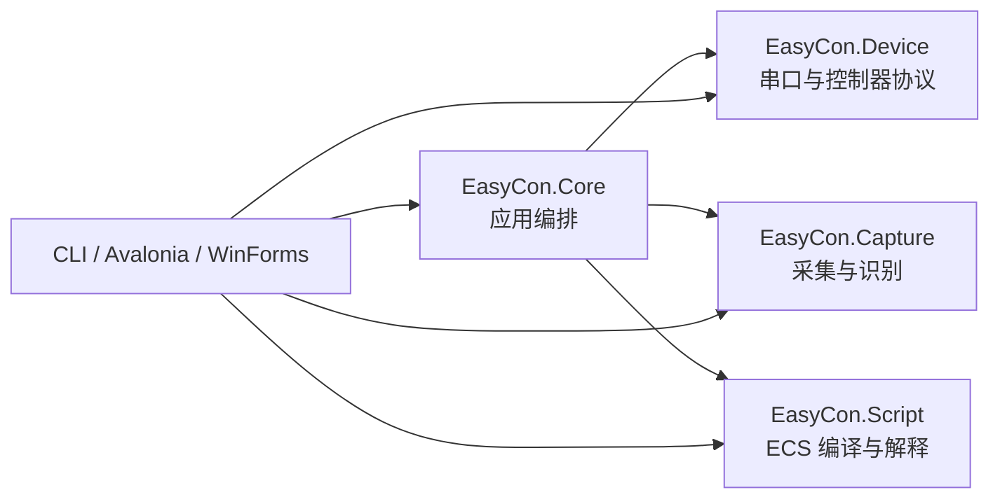

# 源码能力映射

## 1. 审计边界与方法

**[源码事实]** 本次只读审计覆盖本地 `EasyCon/src/EasyCon.Device`、`EasyCon/src/EasyCon.Capture`、`EasyCon/src/EasyCon.Script`、`EasyCon/src/EasyCon.Core`，并追踪到 `EasyCon2.CLI`、两套 Avalonia 服务、WinForms 服务、测试和固件服务中的实际调用链。四个核心项目分别有 17、16、67、30 个文件，现有 `test/` 只有 9 个文件。

除另有说明外，证据路径相对 `EasyCon/src/`，格式为 `相对路径:行号（符号）`。行号只定位当前本地快照；设计以符号和行为为准，不将该快照变成外层仓库的依赖锁。

迁移结论使用四种动作：

- **保留**：用户可见语义或协议可作为 v1 兼容基线。
- **迁移**：在 Rust 中重新实现，不复制原有线程、资源或错误处理方式。
- **桥接**：由私有 C++ 层承载原生库调用，Rust 仍拥有状态和生命周期。
- **排除**：不进入 v1 产品、公共 ABI 或官方绑定。

## 2. 源码项目关系

**[源码事实]** `EasyCon.Core.csproj` 同时引用 Device、Capture、Script，并额外引入 Python 和 Lua 运行时；这些应用层依赖不能原样成为共享核心。`EasyCon.Capture.csproj` 引入 OpenCvSharp、FlashCap、ImageSharp 和 Tesseract；`EasyCon.Device.csproj` 只直接引入串口包；Script 项目无外部包引用。

## 3. Controller 映射

| 源码组件与证据 | 已验证行为 | v1 归属 | 动作与约束 |
| --- | --- | --- | --- |
| `EasyCon.Device/ECDevice.cs:5-7` (`ECDevice.GetPortNames`) | 发现能力只是列出系统串口名，没有设备身份探测或稳定 ID | `easycon-serial::discovery` | 迁移。返回结构化描述符；端口名保留，VID/PID 等信息只在系统可提供时填充 |
| `JoyStickDevice.cs:39-68` (`TryConnect`) | 先用 115200，失败后等待 100 ms 再用 9600；成功后启动报告循环 | `easycon-controller::session` + `easycon-serial` | 保留握手顺序，迁移为异步 operation；不得阻塞调用线程 |
| `NintendoSwitchCmd.cs:16-64` (`_TryConnect`) | 创建连接后等待 1 秒的 Connected/Error 信号 | Controller 连接状态机 | 保留超时含义；使用单调时钟和显式 deadline |
| `TTLSerialClient.cs:83-236` | 当前 `NintendoSwitch` 实际实例化旧 `TTLSerialClient`；单线程忙轮询收发，取消只发信号，不等待关闭 | `easycon-serial` | 只保留字节协议，不迁移循环、锁或销毁方式 |
| `TTLSerialClient.cs:8-81` 与 `SerialPortClient.cs` | 新连接实现含心跳代码，但未被当前路径采用；重连调用被注释；`TTLv2SerialClient.Connect` 在 Open 后仍会抛出“连接失败” | 无公共能力 | 排除“自动重连已存在”的假设。v1 默认不自动重连，断线发事件 |
| `SwitchReport.cs:3-52` | 状态为 `Button + HAT + LX/LY/RX/RY`，按 7 位数据块编码并在末块置高位结束标志 | `easycon-controller::protocol` | 保留为协议黄金向量，Rust 迁移 |
| `SwitchCommand.cs:12-42` | 14 个按钮、8 向 HAT、中心值；摇杆范围 0..255、中心 128 | `easycon-model` + Controller | 保留数值语义；公共 API 使用稳定枚举和显式坐标 |
| `ECKeyUtil.cs:19-57` | 按钮/HAT/双摇杆最终都修改一份共享 `SwitchReport` | Controller desired-state | 迁移为单写者状态机；禁止跨线程直接修改报告 |
| `JoyStickDevice.cs:81-148` | Down/Up、组合方向和 HAT 操作进入 `_keystrokes` 字典 | Controller command lane | 保留用户语义；实现改为有序命令，不使用对象锁或覆盖式字典 |
| `NintendoSwitchPriv.cs:5-86` | 最小发送间隔固定 30 ms；报告循环按时间处理动作 | `easycon-runtime::scheduler` | 保留 30 ms 默认下限，改用单调时钟和绝对目标时间 |
| `ECKey.cs:12-19` + `NintendoSwitchPriv.cs:68-73` | `KeyStroke` 构造器接收 `time`，但字段总是 `DateTime.Now`，因此未来释放时间未保存 | 不作为兼容行为 | 修复。差分测试不能把此缺陷固化；序列时序以文档契约为准 |
| `NintendoSwitchCmd.cs:83-107` | 同步命令通过临时接收处理器等待谓词匹配，默认 100 ms | Controller request/response lane | 迁移为每连接唯一的请求匹配器，禁止多个临时监听器争用相同字节流 |
| `NintendoSwitchCmd.cs:232-271` | Amiibo 数据按 20 字节分包，ACK 失败时握手后重试；可切换索引 | Controller Amiibo operations | 保留分包/ACK 协议；长度、槽位由已验证设备能力约束 |
| `GamePadAdapter.cs:13-68` | ECS 按键/摇杆动作映射到 `NintendoSwitch`；延时后再释放 | Automation Controller port | 迁移到 Rust 内部 trait，不形成跨 ABI 回调 |
| `OperationRecords.cs` | 手工操作可转成 ECS 文本 | 无 | 排除 v1；不是 Controller 首批能力 |
| `NintendoSwitchCmd.cs:130-230` 中固件、远端脚本、LED、配对和改色命令 | 与首批 Controller 能力无关 | 无 | 固件写入和远端脚本明确排除；其余不进入 v1 稳定 API |

### Controller 兼容基线

**[已决定]** 协议编码、按钮/HAT/摇杆数值、115200→9600 握手顺序、30 ms 默认报告间隔和 Amiibo 20 字节分包是迁移基线。

**[推导]** 原源码的壁钟调度、忙轮询、临时事件竞争、取消不等待和计时字段缺陷都不是用户语义。新实现以单调时钟、单写者命令队列和确定性关闭替代。

## 4. Automation 映射

| 源码组件与证据 | 已验证行为 | v1 归属 | 动作与约束 |
| --- | --- | --- | --- |
| `EasyCon.Script/Compilation.cs:22-60` | 创建编译时自动加载主文件旁 `lib/*.ecs`，解析并返回诊断；记录是否有按键和图像标签依赖 | `easycon-ecs::compiler` | 迁移。模块名排序后编译，消除目录枚举顺序的不确定性 |
| `Syntax/Lexer.cs`、`Syntax/Parser*.cs`、`Binding/Binder.cs` | 完整管线为词法、语法、绑定、降低和解释执行 | `easycon-ecs` | 在 Rust 中重建，保留语言行为和诊断位置 |
| `Binder.cs:44-119` | lib 与主脚本分阶段绑定；lib 函数对主脚本可见；lib 不能访问主脚本全局；全局语句最终组成 `$eval` | ECS 编译语义 | 保留并建立黄金测试 |
| `Binder.cs:253-287` | `IMPORT` 被绑定为 NOP；实际可见库来自 `lib` 全量加载 | ECS 兼容加载器 | v1 保留这一现状，不擅自实现选择性导入 |
| `Diagnostic.cs:6-29`、`Text/*` | 诊断区分 error/warning，携带文件、字符 span 和起止行 | `easycon-model::diagnostic` | 迁移并补齐起止列、稳定诊断码；中文消息不是机器判断依据 |
| `Evaluator.cs:97-170` | 绑定树在单个执行流中解释；循环在每条已降低语句边界检查取消 | `easycon-ecs::evaluator` | 保留顺序语义；所有阻塞内建函数也必须可取消 |
| `Evaluator.cs:328-359` | 按键和摇杆语句通过 `ICGamePad` 执行 | `AutomationPorts::Controller` | 迁移为内部 trait，由聚合核心实现 |
| `Evaluator.cs:201-205` | `@标签` 在求值时调用外部 getter，得到整数 | `AutomationPorts::Vision` | 保留为 0..100 的整数匹配分；每次访问使用一个不可变帧快照 |
| `BuiltInFuncs.cs` + `BuiltinCallable.cs` | WAIT/PRINT/ALERT/RAND/TIME/AMIIBO/BEEP/LEN/APPEND 为内建函数 | ECS runtime | 保留语法；PRINT/ALERT/BEEP 只生成事件，v1 不执行推送或 UI 副作用 |
| `CustomSleep.cs:8-17` | 高精度 WAIT 先异步等待再自旋，并响应取消 | Runtime scheduler | 只保留精确且可取消的目标；统一使用 Rust 单调调度器 |
| `GamePadAdapter.cs:13-25` | 点击等待被取消时，`Up` 不在 `finally` 中，可能留下按下状态 | Automation 清理协议 | 修复。运行终态必须在标记完成前发送中立报告并释放控制权 |
| `Scripter.cs`、`EasyRunner.cs` | Core 只薄封装 ECS 编译和运行；`Assemble` 当前抛 `NotImplementedException` | `easycon-sdk` façade | 保留编译/运行编排；字节码接口排除 |
| `Scripter.cs:17-26` | `Parse(code, fileName, ...)` 在 fileName 非空时重新从文件加载，忽略传入 code | ECS compile request | 不保留歧义；v1 明确区分 in-memory source bundle 与受限目录加载 |
| Avalonia `ScriptService.cs:70-125` | 运行在后台任务，Stop 只请求取消，最终块调用设备 Reset | Automation operation | 将“取消后 Reset”提升为核心强制不变量，不依赖 UI 服务 |
| CLI `Program.cs:102-199` | 命令行直接组合标签、采集、设备和 runner，说明这些能力可在无 UI 环境运行 | 共享核心用例 | 保留组合能力，不迁移 CLI 生命周期缺陷 |
| `Runner/PyRunner.cs`、`Runner/LuaRunner.cs` | Python Runner 的键名未映射且取消未接通；Lua 仍为 TODO 示例 | 无 | 明确排除 v1 |
| `Assembly/` 与固件服务 | 生成单片机字节码或固件 | 无 | 明确排除 v1 |
| `ForeignFunction.cs` | 可注册调用方委托，但现有委托无取消和线程契约 | 无公共 v1 能力 | 不跨 C ABI 暴露自定义函数回调；以后单独设计 |

### ECS v1 语义边界

**[已决定]** v1 支持当前源码已经进入编译/解释管线的 ECS 语言：变量/常量、整数/布尔/字符串/数组、表达式、IF、FOR、WHILE、BREAK/CONTINUE、函数、按键/摇杆、WAIT、Amiibo、标签读取和现有内建函数。

**[推导]** `RAND` 接收可选 run seed；默认 seed 在运行开始事件中公开。`TIME` 使用运行开始后的单调毫秒数。这样既保留用途，又能重放测试。

## 5. Vision 映射

| 源码组件与证据 | 已验证行为 | v1 归属 | 动作与约束 |
| --- | --- | --- | --- |
| `EasyCon.Capture/Capture.cs:10-107` | Windows 用 DirectShow 名称枚举，其他系统尝试 FlashCap，失败后探测前 10 个索引；采集 API 枚举直接暴露 OpenCV 枚举 | `easycon-vision::discovery` + 私有桥接 | Windows 首发由 C++ 桥接枚举；公共 API 返回自有稳定 backend 枚举，不暴露 OpenCV 数值 |
| `CVCapture.cs:6-72` | `OpenCVCapture` 包装 `VideoCapture`，设置分辨率、MJPG/30 FPS，读取新 `Mat` 并可 Dispose | `easycon-vision::capture` + 私有桥接 | 桥接。Rust 拥有状态、采集线程和帧生命周期；C++ 只拥有原生 capture 对象 |
| Avalonia `CaptureService.cs:94-112` | 通过锁串行读取并返回克隆帧 | Vision 最新帧槽 | 迁移为单采集线程 + 不可变最新帧，避免每个调用方直接读设备 |
| `Search.cs:11-21` | 实际启用 SqDiffNormed、CCorrNormed、CCoeffNormed、EdgeDetectXY、EdgeDetectLaplacian、OCR | Vision template/OCR | 这五种图像匹配模式和 OCR 作为 v1 兼容集合 |
| `MatchFacts.cs:11-56` | 使用 OpenCV MatchTemplate；SqDiff 取 min，其余取 max；再换算匹配分 | `easycon-vision::match` + 私有桥接 | 桥接算法，Rust 统一把分数规范化到 0.0..1.0 |
| `CVSearch.cs:21-88` | XY Sobel 平均和 Laplacian 预处理；Canny 有实现但没有进入启用列表及 Search 分支 | 私有桥接 | 迁移前两种；Canny 不进入 v1 稳定枚举 |
| `OCRDetect.cs:5-30` | 默认 `chi_sim`、SingleLine；每次调用创建 TesseractEngine；数据路径固定为进程相对 `./Tessdata` | `easycon-vision::ocr` + 私有桥接 | 桥接；模型路径由 Runtime 配置，按语言缓存/池化引擎，不依赖当前工作目录 |
| `ImgLabel.cs:10-129` | `.IL` 为 JSON，含算法、Base64 目标、搜索区和目标区；name/path 来自文件系统 | `easycon-vision::label` | 在 Rust 用结构化解析器迁移；标签不可变，名称和来源独立于当前目录 |
| `ImgLabel.cs:159-202` | 标签搜索裁剪 ROI，图像模板匹配或 OCR，最终把分数乘 100 | Vision label evaluate | 保留 0..100 ECS 适配值；公共 Vision 结果使用 0.0..1.0 |
| `ECCore.cs:17-50` | 从多个 `ImgLabel` 目录加载 `.IL`，按名称去重并跳过后出现者 | label registry | 改为稳定排序和显式 duplicate diagnostic；默认重复名是编译/加载错误 |
| `ImgLabelX.cs` | 对外只有名称可设置；核心字段私有；写入把 0xFF 当结束符，读取却先把下一字节当扩展标记 | 无 | `.ILX` 不具备可验证的稳定契约，v1 排除 |
| `MatExtensions.cs` | 使用 ImageSharp 在 BGR/BGRA/Gray 与 PNG 间转换，失败时吞异常并返回空对象 | Vision image codec | OpenCV 编解码由桥接承担；错误必须显式传播，不允许空结果掩盖失败 |
| `HSVColor.cs` | 只提供 RGB↔HSV 换算，没有接通的区域颜色检测 API | `easycon-vision::color` | 为满足已定产品能力新增 HSV 区域检测：匹配像素数、比例、可选包围框 |
| `Search.cs:106-362` | Strict/Random/Opacity/Similar/FindColor 属于未接通旧代码，且含 32 位指针截断写法 | 无 | 排除，不作为兼容或桥接依据 |

### Vision 兼容基线

**[已决定]** `.IL`、三个归一化模板算法、XY/Laplacian 边缘模板、默认简体中文单行 OCR 和 ECS 的整数百分比分是 v1 基线。

**[推导]** 公共 Vision API 不暴露 `Mat`、`Bitmap` 或 Tesseract 类型。帧、图像和标签都是核心拥有的不透明资源，跨 ABI 只给稳定元数据和显式复制/编码结果。

## 6. Core 与相关项目归属

| 源码区域 | 事实 | v1 处理 |
| --- | --- | --- |
| `EasyCon.Core/ECCore.cs` | 静态便捷入口聚合设备、采集、算法和标签 | 由实例化 `Runtime` 取代，禁止进程全局可变状态 |
| `EasyCon.Core/Scripter.cs` | 保存 runner 与外部 getter，未定义并发访问 | 由不可变 Program + 单次 Run operation 取代 |
| `EasyCon.Core/ProjectManager.cs` | ZIP 工程编辑和文件写入职责 | 排除；v1 只接受显式源码 bundle 或受限目录加载 |
| `EasyCon.Core/Config/*` | AppData 配置和网络推送 | 排除；SDK 只接受调用方传入的 options |
| `EasyCon.Core/Assist/` (`AssistClient`) | 连接固定远程地址并发送消息 | 远程助手排除，不进入依赖图 |
| `EasyCon2*` UI、WinInput | UI 状态、键盘映射、虚拟面板和对话框 | 全部排除；只能作为调用模式证据 |
| `EasyCon2.CLI` | 无 UI 组合运行能力，但资源释放并不完整 | 不迁移 CLI；用其证明共享核心无需 UI |
| `fw/` 与 FirmwareService | 固件生成、写入和板型列表 | 全部排除 |

## 7. 不得继承的源码行为

以下是已经从源码直接确认的实现问题，而非待猜测事项：

1. 动作未来时间未写入 `KeyStroke.Time`，不能作为时序兼容基线。
2. 取消按键点击可能绕过释放，必须由运行终态清理兜底。
3. 当前连接路径没有已工作的自动重连；v1 不宣称该能力。
4. 多个同步 ACK 等待器可同时监听同一接收流；新核心必须串行化 request/response。
5. capture、frame、event 和后台任务在多个应用服务中由 UI 习惯性清理，不能成为库生命周期。
6. 图像转换吞异常、标签加载打印后跳过、CLI 中的帧未处处释放；新 ABI 必须传播错误并明确所有权。
7. `.ILX` 和未接通的像素算法不是完成能力。
8. Python/Lua、固件、远程助手、配置/推送和 UI 都不因存在源码而自动进入 SDK。

这些结论直接驱动 [生命周期规范](runtime-lifecycle.md)、[C ABI 错误模型](c-abi-v1.md) 和 [差分测试分类](testing-strategy.md)。
